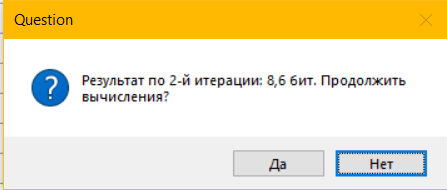

# Калькулятор для вычисления энтропии кодов 256 бит на малых выборках

## Описание
Данное приложение реализует интерполяционный алгоритм использования малоразрядных таблиц вычисления энтропии по статистическим моментам распределения расстояния Хэмминга. 
Программа создана с помощью языка программирования C# на платформе .NET Framework 4.7.2. Приложение не является кроссплатформенным. Целевая операционная система: Windows. Табличные данные хранятся в файле базы данных формата SQLite3.

## Детали реализации
### Приложение имеет три формы:
+ Form1: главная форма приложения;
+ chooseTableDlg: диалоговая форма для выбора таблицы;
+ calculateDlg: диалоговая форма для запуска табличных вычислений.

### В проекте реализованы следующие пространства имён:

#### Calculator.AdditionalModules
Данное пространство имён содержит один второстепенный модуль, а именно:

+ ErrorHandler: статический класс для обработки ошибок и вывода на экран других сообщений.

#### Calculator.Calculate
Это пространство имён отвечает за выполнение табличных вычислений и включает в себя:

+ EntropyCalculator: статический класс, содержащий единственный метод для вычисления среднего арифметического найденных значений;
+ InterpolSearch: статический класс, реализующий интерполяционный поиск во всей таблице;
+ IterTableStruct: структура, хранящая значения таблицы, которая получается при каждой итерации вычислений;
+ TableExtender: класс, реализующий расширение итерационной таблицы в 1,5 раза.

#### Calculator.Database
Данное пространство имён отвечает за работу с базой данных, а именно чтение таблицы из неё. Включает:

+ OpenedTableStruct: структура, хранящая данные данные таблицы, открываемой из файла;
+ SQLiteHelper: класс, реализующий открытие таблицы из файла.

### Проект имеет следующие зависимости:
+ EntityFramework;
+ Stub.System.Data.SQLite.Core.NetFramework;
+ System.Data.SQLite;
+ System.Data.SQLite.Core;
+ System.Data.SQLite.EF6;
+ System.Data.SQLite.Linq.

## Хранение данных
Табличные значения, по которым производятся расчёты, хранятся в базе данных формата SQLite3 в файле database.sqlite3, который входит в состав архива с исполняемым файлом. На данный момент база данных содержит одну таблицу, а именно таблицу связи значений энтропии и математического ожидания расстояний Хэмминга со стандартным отклонением, которая внутри базы данных называется "entropy_hamming_deviation". Таблица имеет 29 столбцов и 25 строк. Первый столбец - id, порядковый номер записи, второй - значения математического ожидания расстояний Хэмминга, остальные столбцы - это значения стандартного отклонения. Так как название столбца не может состоять только из цифр, в начало заголовка столбца записывается символ c, который игнорируется программой при чтении базы данных. Таблица, непосредственно хранящаяся в файле имеет следующий вид:

<p align="center"> 

</p>

На этом изображении таблица была открыта для просмотра с помощью инструмента SQLiteStudio.

## Использование
Вы можете скачать архив с исполняемым файлом по [этой ссылке](binary/Release.zip). Распакуйте скачанный архив и запустите исполняемый файл Calculator.exe.

Вначале запущенное приложение будет иметь следующий вид:

<p align="center"> 

</p>

Прежде чем начать вычисления, следует выбрать таблицу. Вы можете это сделать, нажав ```"Выбрать таблицу"``` в верхнем меню.

<p align="center"> 

</p>

Затем вам будет предложено две таблицы на выбор. Выберите нужную и нажмите на кнопку ```"Выбрать"```.

<p align="center"> 

</p>

После этого на экране отобразится таблица. Чтобы вычислить значение, нажмите на ```"Вычисление значения"``` в меню.

<p align="center"> 

</p>

После чего в диалоговой форме введите реальные значения математического ожидания расстояний Хэмминга и стандартного отклонения соответственно и нажмите кнопку ```"Начать вычисление"```. Обратите внимание, ```дробную часть значения следует записывать не после точки, а после запятой```.

Сначала программа найдёт в таблице четыре ближайших значения энтропии и выведет их среднее арифметическое в виде сообщения MessageBox. Затем будут произведены итерационные табличные вычисления, результаты которых будут также выведены в виде MessageBox. После каждой итерации вам будет предложено продолжить, либо остановить вычисления. После того, как вы остановите вычисления, результаты будут записаны в txt-файл, который запустится автоматически.

## Пример
Для примера реализации вычислений возьмём значение математического ожидания расстояний Хэмминга, равное 108,2 и стандартное отклонение 38,3. Вывод ответа выглядит следующим образом:

<p align="center"> 

</p>

<p align="center"> 

</p>

Нажмите ```"Да"```, если хотите продолжить вычисления.

<p align="center"> 

</p>

Остановить вычисления можно нажав на ```"Нет"```. После остановки вычислений ответ будет сформирован подобным образом:

<p align="center"> 

</p>
