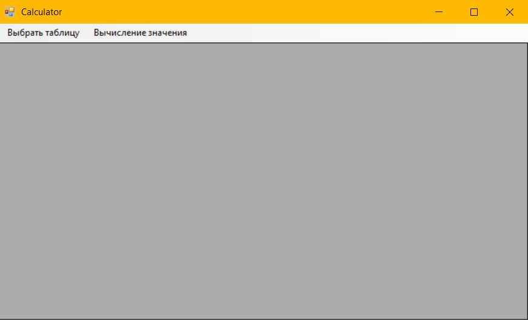
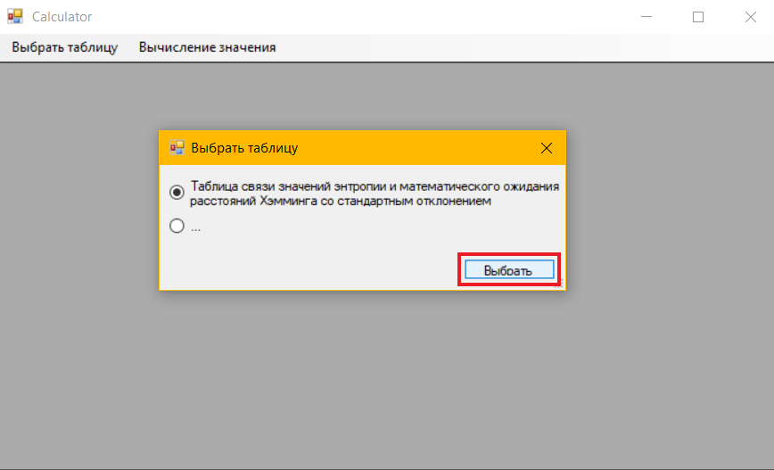

# Calculator

## Использование
Вначале запущенное приложение имеет следующий вид:

<p align="center"> 

</p>

Прежде чем начать вычисления, следует выбрать таблицу. Вы можете это сделать, нажав ```"Выбрать таблицу"``` в верхрем меню.

<p align="center"> 

</p>

Затем вам будет предложено две таблицы на выбор. Выберите нужную и нажмите на кнопку ```"Выбрать"```.

<p align="center"> 

</p>

После этого на экране отобразится таблица. Чтобы вычислить значение, нажмите на ```"Вычисление значения"``` в меню.

<p align="center"> 

</p>

После чего в диалоговой форме, пример которой приведён ниже, введите реальные значения математического ожидания расстояний Хэмминга и стандартного отклонения соответственно и нажмите кнопку ```"Начать вычисление"```. Обратите внимание, ```дробную часть значения следует записывать не после точки, а после запятой```.

Сначала программа найдёт в таблице четыре ближайших значения энтропии и выведет их среднее арифметическое в виде сообщения MessageBox. Затем будут произведены итерационные табличные вычисления, результаты которых будут также выведены в виде MessageBox. После каждой итерации вам будет предложено продолжить, либо остановить вычисления. После того, как вы остановите вычисления, результаты будут записаны в txt-файл, который запустится автоматически.

## Пример использования
Для примера реализации вычислений возьмём значение математического ожидания расстояний Хэмминга, равное 108,2 и стандартное отклонение 38,3. Вывод ответа выглядит следующим образом:

<p align="center"> 

</p>

<p align="center"> 

</p>

Нажмите ```"Да"```, если хотите продолжить вычисления.

<p align="center"> 

</p>

Остановить вычисления можно нажав на ```"Нет"```.

<p align="center"> 

</p>
