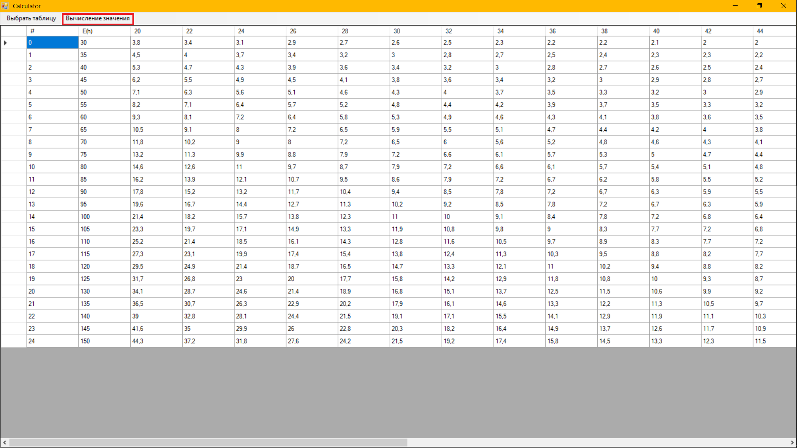
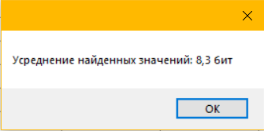
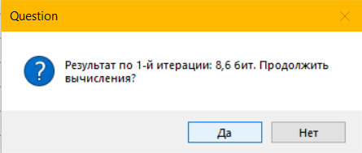

# Что реализовано
## 0. Общее описание
Проект написан на C#, платформа - .NET Framework. Если нужна кроссплатформенность, можно будет перенести на .NET Core. Данная реализация - proof of concept, поэтому код особой изысканностью не отличается. Рефакторинг можно будет провести позже.

## 1. Графический интерфейс
В проекте добавлено три формы: главная форма, и две диалоговых. Главная форма содержит меню, позволяющее открывать или сохранять таблицу, а также проводить над ней необходимые преобразования, 4 кнопки для манипуляции таблицей, и непосредственно таблицу. Запущенная программа выглядит следующим образом:


Чтобы сформировать таблицу, выберите ``` "Таблица" -> "Сформировать новую" ``` в верхнем меню:


Чтобы добавить столбец в таблицу, нажмите на кнопку, выделенную на скриншоте ниже:


Затем введите заголовок столбца таблицы:


Чтобы добавить строку в таблице, нажмите на вторую кнопку:



Следующие две кнопки созданы для удаления столбца и строки таблицы соответственно. Чтобы удалить строку в таблице, выделите её, нажав на область, выделенную на скриншоте ниже:



И затем нажмите на четвёртую кнопку:



Кнопка для удаления столбцов временно не работает.

Для того, чтобы ввести значение в ячейку, нажмите на неё два раза. Пока все данные, включая порядковый номер следует вводить вручную. ```Примечание: дробную часть чисел следует вводить не через точку, а через запятую.```

## 2. Непосредственно выполнение преобразований
Сформируем часть таблицы из примера в документе, что был прислан мне ранее. Таблица имеет следующий вид:


Чтобы выполнить преобразования, нажмите на ```"Вычисление значения"``` в верхнем меню:


Затем в форму введите реальные значения математического ожидания расстояний Хэмминга и отклонения соответственно в первые два поля, а затем введите в третье поле количество итераций табличных вычислений:


В примере используются значения из документа, присланного мне ранее. Результаты вычислений программа выведет в виде сообщений MessageBox:


## 3. Хранение данных
Данные хранятся в файле базы данных формата SQLite3. Таблица внутри базы данных называется test_table. Программа позволяет создавать эти базы данных и редактировать созданные ранее. Чтобы сохранить таблицу в виде файла базы данных SQLite выберите ```"Таблица" -> "Сохранить текущую"```. Затем в диалоговом окне выберите путь сохранения, укажите имя и расширение файла и нажмите кнопку "Ок". Чтобы открыть созданую ранее базу данных выберите ```"Таблица" -> "Открыть созданную ранее"```, затем в диалоговом окне выберите файл и нажмите кнопку "Ок".
